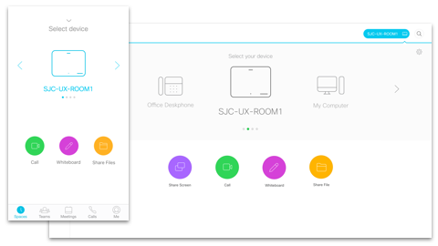

Title: Spark OBTP 2017
Desc: Mobile and Desktop OBTP (One Button to Push) prototype.
Date: 2017-1-20
Cover: prototypes/Spark OBTP_Cover.png
---

### Mobile Prototype

[SparkMobileP5](https://uxccds.github.io/SparkMobile/SparkMobileP5/)

### Desktop Prototype

[OBTP-Prototype.html](https://uxccds.github.io/Spark-Hype-MVO/OBTP-Prototype.html)

### MX Prototype

[mx.html](https://uxccds.github.io/SparkMobile/pair/page/mx.html)

# Instuctions for use

### On Mobile

1) Please use Chrome (mobile mode) or IPhone (webapp mode) to view the prototype.

2) Try clear browser cache first if you see any issues.

3) Choose a version to continue.

### On Desktop

1) Please use Chrome to view this prototype.

### On MX

1) Please use Chrome to view this prototype.

2) The MX logic for hot key

* '0' - go to step 0

* '1' - go to step 1 and update the mobile/desktop prototype

* 'd' - change the scenario to desktop mode

* 'm' - change the scenario to mobile mode

3) You need to add a parameter after the url for both MX prototype and mobile/desktop prototype.

e.g.: 

The link for mobile index page	
[SparkMobileP5/?room=public](https://uxccds.github.io/SparkMobile/SparkMobileP5/?room=public)

The link for MX
[mx.html?room=public](https://uxccds.github.io/SparkMobile/pair/page/mx.html?room=public)

In this example, the parameter added is 'room'.
The parameter's value could be 'CCDS', 'UE', 'UT', 'private' or 'public'.

4) Only when the mx prototype and mobile/desktop prototype use the same name will they be paired.

