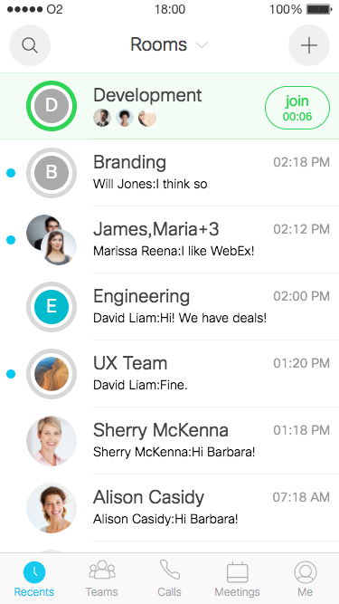

Title: Spark P5 2016
Desc: Spark P1 prototype.
Date: 2016-9-20
Cover: prototypes/Spark P5 2016_Cover.png
---

To let the users adapt to our new Spark design more smoothly, the UXCCDS team defined 5 steps to update the Spark app's style. This is the P5 prototype. We use react.js to build this prototype and many parts of this prototypes are based on dynamic data.

## Screen shot

# Launching the prototype

You can launch this prototype through the following ways: 

1) Open the prototype in Chrome's mobile simulator. Click [here](../guide/chrome's-mobile-simulator.html) to learn more.

2) Install the prototype on your iPhone as a web app. Click [here](../guide/install-web-app.html) to learn more.

## Prototype Link

[p5.html](https://uxccds.github.io/SparkMobile/v2/page/p5.html)

# Goals

This prototype aims to demostrate the following goals:

1) Demostrate the full experience of Spark app.

2) Smoonther transition animation between pages.

3) Apply PIP to Spark.

# How-tos

1) Click the 'Branding team' 's line to enter its room.

2) Click the activity board's icon on the top-right corner to open it.

3) Click each ball on the activity board to experience each feature.

4) Each room has its own data for the chat panel. You can send messages here and the bot may respond to certain specific terms.

