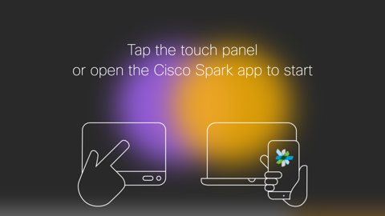

Title: Spark Pairing 2017
Desc: Mobile and Desktop Spark Prototype featuring the pairing functions
Cover: prototypes/Spark Pairing_Cover.png
---

### Mobile Prototype

[sparkMobilePair.html](https://uxccds.github.io/SparkMobile/SparkMobilePairing/sparkMobilePair.html)

### Desktop Prototype

[devicepairing-desktop.html](https://uxccds.github.io/Spark-Hype-MVO/devicepairing-desktop.html)

### MX Prototype

[sparkboardpair.html](https://uxccds.github.io/SparkMobile/pair/page/sparkboardpair.html)

# Instuctions for use

### On Mobile

1) Please use Chrome (mobile mode) or IPhone (webapp mode) to view the prototype.

2) If you see any issues, try clearing your browser cache first.

3) Choose a version to continue.

### On Desktop

1) Please use Chrome to view this prototype.

### On MX

1) Please use Chrome to view this prototype.

2) You can use the following hot keys to go to the screens.

key space -> black screen

key 1 -> the 'hello' screen.

key 2 -> the screen with activity balls

