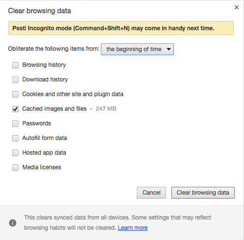

Title: Clear Cache
IndexPage: true
SortIndex: 1
Cover: guide/clearCache1.png
---

Browers usually cache datas to speed up loading web pages. This is why sometimes you can not see the latest version of the web pages. And cache sometimes will cause some bugs.

We list some ways to clear the cache so that you can get the 

# Clear cache in Chrome

The following steps show how to clear cache in Chrome on Mac OS. You can do similar things in other browers on different platforms.

1) Open the history tab

2) Click 'Clear browsing data'

3) Select 'Cached images and files' and choose the 'the beginning of time'

4) Click button 'Clear browsing data' to clear the cache.

# Clear cache for web apps

1) Clear the brower's cache. (system's native browser, such as Safari for IOS)

2) Remove the web apps from the desktop and reinstall it. 