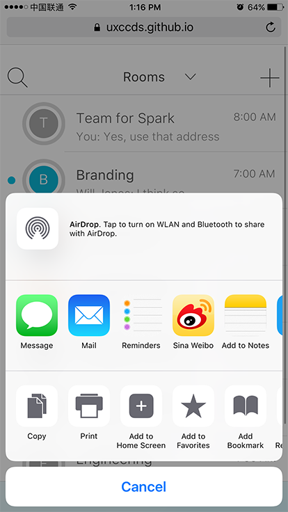

Title: Install Web App
SortIndex: 2
Cover: guide/InstallWebAppIOS1.PNG
---

To achieve the best experience of our mobile prototypes, we recommand you installing the prototypes as web apps on your mobile devices.

# Install web apps on iPhone

The following steps show how you can install web apps on your iPhone.

1) Open the prototype in Safari.

2) Click the share button on the bottom-middle of Safari. Then click the button 'Add to Home Screen'.

3) You can update the web app's name if you want. Then click 'Add'.

4) Now you can find the web app on the desktop. 

5) Play the prototype just as the native app.