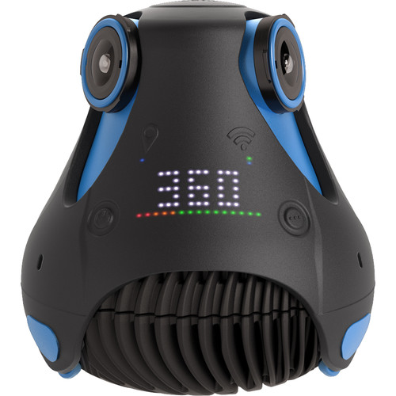
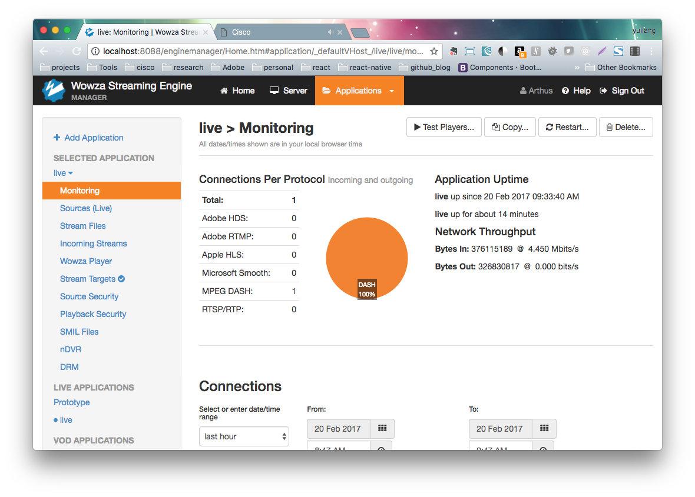
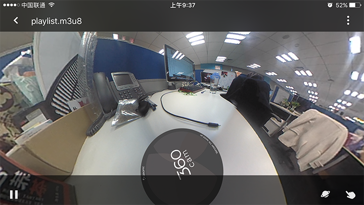
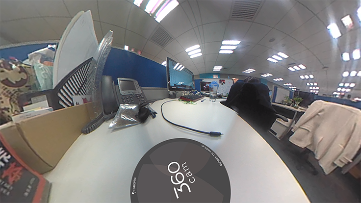
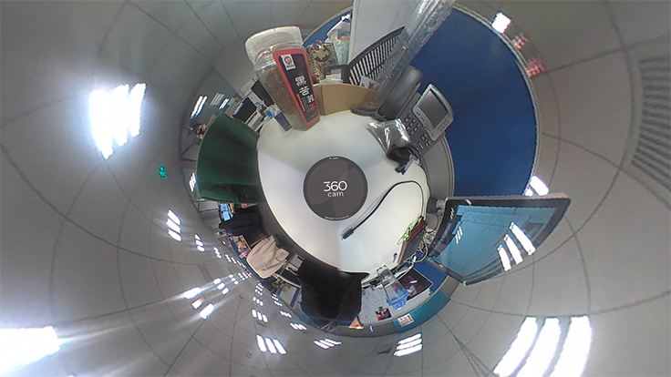
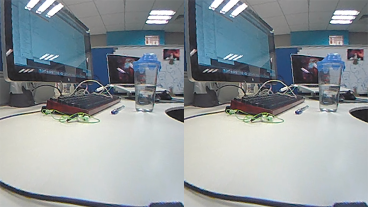
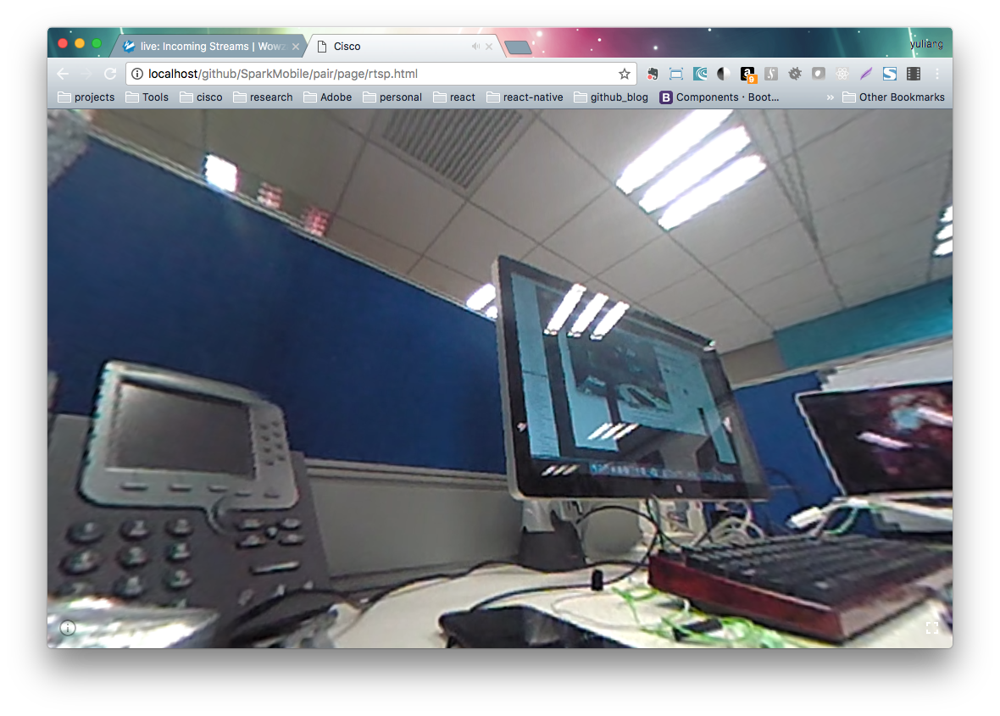

Title: 360° Camera and VR
Cover: research/360°VR6.png
Date: 2017-2-29
---

We started to learn AR/VR technology years ago. It should be able to improve our meeting experience.

# Camera

In order to get VR video, we should take 360° view video at first. We bought [Giroptic's 360cam](https://www.giroptic.com/us/en/360cam) and its PoE Ethernet Adapter Base to set up the IP camera system.

# Streaming server

You can get a RTSP stream from the IP camera directly. However, lots of media player does not support RTSP stream. RTSP is designed for Flash only, so we need a server to convert the stream to other formats.

[Wowza Streaming Engine](https://www.wowza.com/products) is best solution I can find. Here is the dash board for Wowza Stream Enginer.

# Watch the live on iPhone

## 360° View

You can use Insta360Player to watch the 360° live. It's not a sized video any more. You can swipe to choose best view. 

### Normal View 

### Full Fcreen View

### Zoom Out View

## VR View

If you have any VR glass, you can watch the life in VR mode.

# HTML prototype

It's also possible to display the 360° View video with HTML5. The following is a screenshot for our simple demo.

