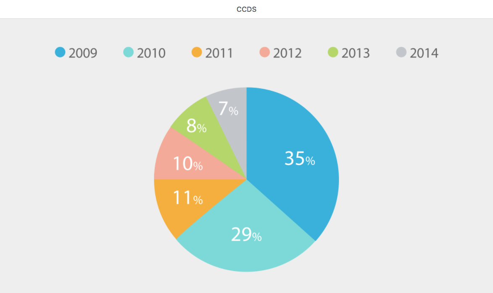

Title: Firebase
Date: 2016-9-1
Cover: research/Firebase1.png
---

We've done some researchs on how to build connection between devices. Web database is one of the choice. In our current projects, we choose [Firebase](https://firebase.google.com). Firebase saves us a lot of time on coding server end code. So we focus more on the front end coding.

# Prototype

Here is demo with Firebase. 

## Desktop

### link

[wall.html](https://uxccds.github.io/SparkMobile/pair/page/wall.html)

### usage

1) Please use Chrome to open this prototype.

2) Wait for the loading and open the mobile protoype when you see the following screen.

 

## Mobile

### link

[phone.html](https://uxccds.github.io/SparkMobile/pair/page/phone.html)

### usage

1) Use [Chrome mobile simulator](../guide/chrome's-mobile-simulator.html) to view the prototype. You can also install the prototype as [web app](../guide/install-web-app.html) on your iPhone.

2) Click 'All Boards' to the selection page.

3) Select one board.

4) When you do step 2 and step 3, the desktop prototype will do the same thing automatically.

