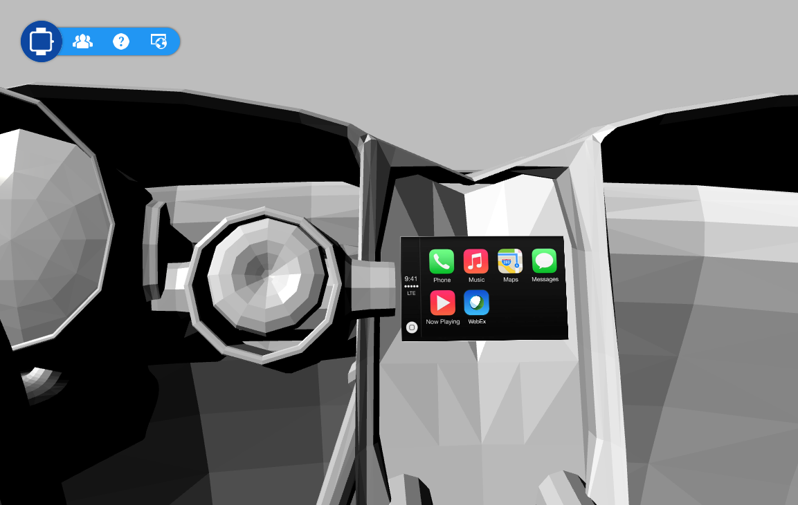

Title: WebGL
Date: 2017-4-19
Cover: research/WebGL2.png
---

WebGL let browsers have the ablility to render 3D things. 

# Prototype for WebEx on iwatch

Years ago, Apple was going to publish the iwatch. Our company was asked to build the WebEx app on iwatch. However, we did not have the real iwatch at the early time. So we used WebGL to render a 3D model to display the prototype. 

## link (Cisco VPN Required)

[iwatch3d.php](https://uxprototype.cisco.com/projects/Reskin/wap/iwatch_draft/pages/3d.php)

## usage

1) Open the prototype in Chrome.

2) Waiting for loading the 3d model.

3) After the prototype is loaded, you can zoom in/out or turn the iwatch. Drag or Wheel your mouse on the top left corner.

4) Click the WebEx Ball on the iwatch and try to experience it.

# Further More

After that I made a prototype to display all the prototypes I made for windows phone, iPhone, Car, Mac ...

## link (Cisco VPN Required)

[3d.php](https://uxprototype.cisco.com/projects/Reskin/wap/3D/pages/3d.php)

## usage

1) Use the navigation tool on the top left corner to switch models and prototypes.

2) Try to experience the protoypes inside the models.